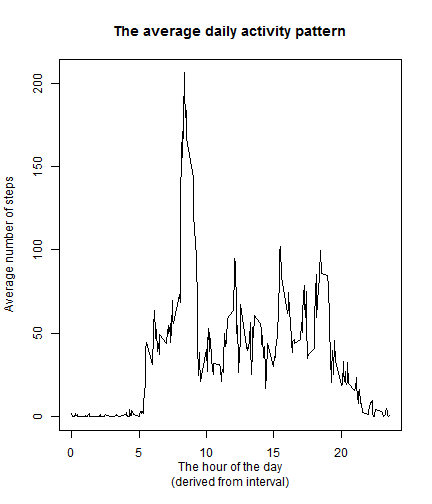
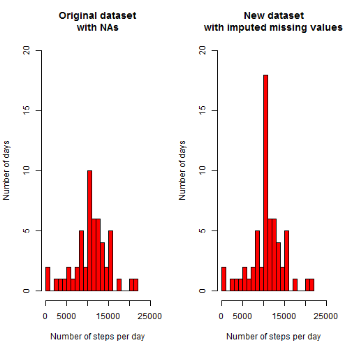

#RepData- Peer Assessment 1

##Loading and preprocessing the data
.  
.  

####Loading data


```r
activityData<-read.csv("activity.csv",header=TRUE,stringsAsFactors = FALSE)
str(activityData)
```

```
## 'data.frame':	17568 obs. of  3 variables:
##  $ steps   : int  NA NA NA NA NA NA NA NA NA NA ...
##  $ date    : chr  "2012-10-01" "2012-10-01" "2012-10-01" "2012-10-01" ...
##  $ interval: int  0 5 10 15 20 25 30 35 40 45 ...
```
.  
. 

####Preprocessing data  

To keep the original data set intact a new data set is created and preprocessed.  
The preprocessing of the data set "activityDataPP" includes  
- adding a variable where the five minutes interval are fromated to hour:minute:second  
- adding a variable where the date is coerced to class:Date  
- create a subset woNA of activityDataPP without "NA", woNA,  
  by first finding out what variables have NAs
  

```r
##New name for the preprocessed dataset, to keep the raw input data still aviable
activityDataPP<-activityData

##Create new variables to format "interval" to Hour:Minute:Second
library(stringr)
activityDataPP$hm<-formatC(activityData$interval,flag=0,width=4)
activityDataPP$HourMinuteSecond<-
        paste(substr(activityDataPP$hm,1,2),":",substr(activityDataPP$hm,3,4),":","00",sep="")

##Create new variable where "date" (class:chr) is coerced to (class:Date)
activityDataPP$asDate<-as.Date(activityDataPP$date,"%Y-%m-%d")

str(activityDataPP)
```

```
## 'data.frame':	17568 obs. of  6 variables:
##  $ steps           : int  NA NA NA NA NA NA NA NA NA NA ...
##  $ date            : chr  "2012-10-01" "2012-10-01" "2012-10-01" "2012-10-01" ...
##  $ interval        : int  0 5 10 15 20 25 30 35 40 45 ...
##  $ hm              : chr  "0000" "0005" "0010" "0015" ...
##  $ HourMinuteSecond: chr  "00:00:00" "00:05:00" "00:10:00" "00:15:00" ...
##  $ asDate          : Date, format: "2012-10-01" "2012-10-01" ...
```
  
.  
Create subset woNA  
The counting of NA shows that there are 2304 NAs in the variable "steps",  
and none in the other two variables.  


```r
##Find out where there are missing values (NA) 
naSteps<-length(which(is.na(activityData$steps)))
naDate<-length(which(is.na(activityData$date)))
naInterval<-length(which(is.na(activityData$interval)))
NAs<-data.frame(stepsNA=naSteps,dateNA=naDate,intervalNA=naInterval)
NAs
```

```
##   stepsNA dateNA intervalNA
## 1    2304      0          0
```


```r
##Create a dataset without NA
woNA<-subset(activityDataPP,activityDataPP$steps!="NA")
str(woNA)
```

```
## 'data.frame':	15264 obs. of  6 variables:
##  $ steps           : int  0 0 0 0 0 0 0 0 0 0 ...
##  $ date            : chr  "2012-10-02" "2012-10-02" "2012-10-02" "2012-10-02" ...
##  $ interval        : int  0 5 10 15 20 25 30 35 40 45 ...
##  $ hm              : chr  "0000" "0005" "0010" "0015" ...
##  $ HourMinuteSecond: chr  "00:00:00" "00:05:00" "00:10:00" "00:15:00" ...
##  $ asDate          : Date, format: "2012-10-02" "2012-10-02" ...
```
.  
.  
.  
.  
.  

-----

##What is the mean total number of steps taken per day? 
.  
.  

Calculating the sum of steps per day by using the subset woNA.  
Create a histogram of the total number of steps taken each day.  


```r
##Calculating the sum of steps for each one of the 61 days
sumOfSteps<-with(woNA, tapply(woNA$steps,woNA$date,sum))

##PLOT
library(datasets)
par(mfrow=c(1,1))
hist(sumOfSteps, breaks=25, main="Total number of steps taken per day",
     xlim=c(0,25000),
     xlab="Number of steps per day",
     ylab="Number of days", 
     col="red")
```

 
.  
.  

Calculation of the mean and the median of the total number of steps per day.  
The mean number of steps per day was calculated to 10766.19 steps/day.  
The median is 10765 steps/day.  


```r
mean(sumOfSteps,na.rm=TRUE)
```

```
## [1] 10766
```

```r
median(sumOfSteps,na.rm=TRUE)
```

```
## [1] 10765
```
.  
.  
.  
.  
.  

-----

##What is the average daily activity pattern?
.  
.  


```r
##Calculate the average number of steps by using melt and dcast
library(reshape2)
dataMelt<-melt(woNA,id=c("interval"),measure.vars="steps")
avgOverDay<-dcast(dataMelt,interval~variable,mean)
avgOverDay$HourMinuteSecond<-levels(as.factor(activityDataPP$HourMinuteSecond))

##Prepare for plot
##by deriving the hour of the day from interval
avgOverDay$hour<-avgOverDay$interval/2400*24

##PLOT
library(datasets)
par(mfrow=c(1,1))
with(avgOverDay,plot(hour,steps,type="l",
                     main="The average daily activity pattern",
                     xlab="The hour of the day\n(derived from interval)",
                     ylab="Average number of steps"))
```

 
. 
.  

The 5-minute interval that contains the maximum number of steps is 835, which corresponds  
to 8:35 in the morning. (Out running maybe :) )

```r
maxHour<-avgOverDay[(avgOverDay$steps==max(avgOverDay$steps)),1:3]
maxHour
```

```
##     interval steps HourMinuteSecond
## 104      835 206.2         08:35:00
```
.  
.  
.  
.  
.  

-----


##Imputing missing values
.  
.  
The strategy for imputing data is to replace NA with the mean value for the 5-minute interval.  
- add a new logical variable. FALSE  means that there is a missing value for that specific observation.  
- create a new data set (newDataSet) with a for-loop using the dataset created in  
the previous task (avgOverDay) to impute the missing values. The class of the  
variable "steps" is in this case numeric since mean values are used for the imputing.  
In the original data set the class is integer.


```r
##Using the input raw data
good<-complete.cases(activityData$steps)
activityData$Good<-good

l<-length(activityData$steps)
newDataset<-data.frame(steps=c(1:l),date=activityData$date,
                       interval=activityData$interval,stringsAsFactors = FALSE)
for(i in 1:l){            
        if(activityData[i,"Good"]==TRUE){
                newDataset[i,1]<-activityData$steps[i];            
        }
        else{
                minuteInterval<-activityData$interval[i];         
                steps<-avgOverDay[(avgOverDay$interval==minuteInterval),2];                
                newDataset[i,1]<-steps;               
        }
}
str(newDataset)
```

```
## 'data.frame':	17568 obs. of  3 variables:
##  $ steps   : num  1.717 0.3396 0.1321 0.1509 0.0755 ...
##  $ date    : chr  "2012-10-01" "2012-10-01" "2012-10-01" "2012-10-01" ...
##  $ interval: int  0 5 10 15 20 25 30 35 40 45 ...
```
.  
.  
Calculating the sum of steps for each one of the 61 days in the imputed dataset.


```r
##Calculating the sum of steps for each one of the 61 days
##in the imputed dataset
sumOfSteps2<-with(newDataset, tapply(newDataset$steps,newDataset$date,sum))

##PLOT
library(datasets)
par(mfrow=c(1,2))
hist(sumOfSteps, breaks=25, main="Original dataset\nwith NAs",
     xlim=c(0,25000),
     ylim=c(0,20),
     xlab="Number of steps per day",
     ylab="Number of days", 
     col="red")
hist(sumOfSteps2, breaks=25, main="New dataset\nwith imputed missing values",
     xlim=c(0,25000),
     ylim=c(0,20),
     xlab="Number of steps per day",
     ylab="Number of days", 
     col="red")
```

 
.  
.  

The total number of missing values were calculated in the section for preprocessing data.
The total number of missing values is 2304, all in the variable "steps".  
naSteps: 2304  
The calculations below shows that these missing data is equivalent to 8 days.  
The histogram above also shows that 8 days are added, all in the interval 10000-11000,  
the interval for mean and median.  
This makes sense, since the imputed data is the 5-minute interval mean.


```r
##Number of observations over one day (=288)
obsPerDay<-length(levels(as.factor(activityData$interval)))

##Equivalent number of days with missing values, "NA" (=8)
numberOf_NA_Days<-naSteps/obsPerDay
numberOf_NA_Days
```

```
## [1] 8
```
.  
.  
Calculation of the mean and the median of the total number of steps per day in teh new dataset.  
The mean number of steps per day was calculated to 10766.19 steps/day  
The median is 10766.19 steps/day.  
(The class of the variable "steps" is in this numeric and not integer as in the  
original data set. This is due to the imputed 5-minute interval mean)


```r
mean(sumOfSteps2,na.rm=TRUE)
```

```
## [1] 10766
```

```r
median(sumOfSteps2,na.rm=TRUE)
```

```
## [1] 10766
```
.  
.  
.  
.  
.  

-----


##Are there differences in activity patterns between weekdays and weekends?
.  
.  


```r
##Add a new factor variable to the dataset woNA (the data set without NAs)
woNA$weekdays<-weekdays(woNA$asDate)
l<-length(woNA$steps)
for(i in 1:l){            
        if(woNA[i,"weekdays"]=="Saturday"|woNA[i,"weekdays"]=="Sunday"){
                woNA[i,"dayCategory"]<-"weekend";            
        }
        else{
                woNA[i,"dayCategory"]<-"weekday";               
        }
}
woNA$dayCategory<-as.factor(woNA$dayCategory)
str(woNA$dayCategory)
```

```
##  Factor w/ 2 levels "weekday","weekend": 1 1 1 1 1 1 1 1 1 1 ...
```


```r
##Calculate the average number of steps for weekdays respectively weekends
##by using melt and dcast
library(reshape2)
dataMelt2<-melt(woNA,id=c("date","interval","dayCategory"),measure.vars="steps")
avgOverDay2<-dcast(dataMelt2,dayCategory+interval~variable,mean)

##Prepare for plot
##by deriving the hour of the day from interval
avgOverDay2$hour<-avgOverDay$interval/2400*24
##and by creating subsets for weekdays and weekends
weekday<-subset(avgOverDay2,avgOverDay2$dayCategory=="weekday")
weekend<-subset(avgOverDay2,avgOverDay2$dayCategory=="weekend")

##PLOT
library(datasets)
par(mfrow=c(1,2))
with(weekday,plot(hour,steps,type="l",
                     main="The average daily activity pattern\nduring weekdays",
                     xlab="The hour of the day\n(derived from interval)",
                     ylab="Average number of steps",
                     ylim=c(0,250)))
with(weekend,plot(hour,steps,type="l",
                     main="The average daily activity pattern\nduring weekends",
                     xlab="The hour of the day\n(derived from interval)",
                     ylab="Average number of steps",
                     ylim=c(0,250)))
```

 

The panel plot shows that there is a difference in activity between weekdays and weekends.  

